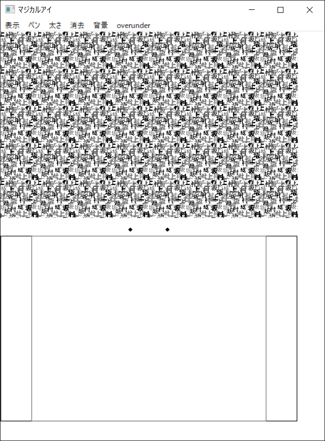

# autostereogram-canvas

A softrware for drawing an autostereogram.

I developed this software ages ago (on my Windows Me, back in my highschool days). Recently I accidentally found the old source codes and the compiled binary and ,surprizingly, it still works on Windows 10! So I decided to make them public.

## How to use
- Download the binary from * and unzip it. No installation is required.
- The screen looks like this.
  - 
  - The menu buttons are in Japanese. See below for their meanings.
  - The upper panel shows the output stereogram.
  - The lower panel is for drawing.
  - The two black dots in the middle are the guides for seeing the stereogram.
- Pushing the menu button "表示" ("Display" in Japanese) will display the drawn stereogram on the upper panel.
- Use the menu button "ペン" ("Pen" in Japanese) for selecting the pen type.
  - "下" ("Below" in Japanese) will make the drawn contents sink below the background. The pen color is blue.
  - "上" ("Above" in Japanese) will make the drawn contents pop out of the background. The pen color is red.
- Use the menu button "太さ" ("Width" in Japanese) to select the line width.
- Pushing the menu button "消去" ("Delete" in Japanese) will delete the drawn contents.
- Use the menu button "背景" ("Background" in Japanese) to select the background. The current version does not support custom backgrounds.
- Usage of the menu button "overunder" is a bit complicated.
	- When "overover" is selected, both blue and red contents will be above the background when displayed.
	- When "overunder" is selected, the red contents will be above the background and the blue contents will be below the background when displayed.
- The above descriptions assumes that you see the stereogram with the wall-eyed viewing. With cross-eyed viewing, the relative position from the background plane will be inverse. (see https://en.wikipedia.org/wiki/Autostereogram for the description of wall-eyed and cross-eyed viewing).
## License
MIT.

Copyright for Some of the background images are not owned by me.

## Misc
The title "マジカルアイ" ("Magical Eye" in Japanese) is taken from Japanese magazine Magical Eye series (https://tkj.jp/magicaleye/).
